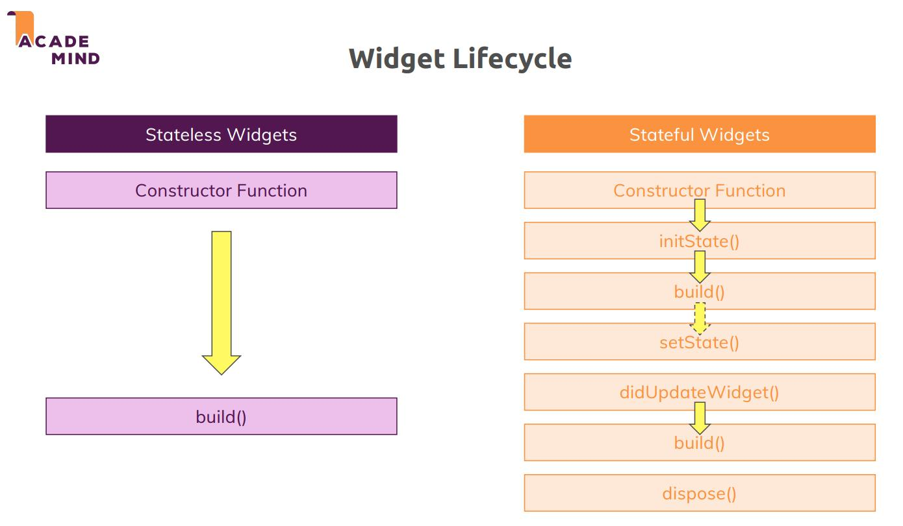
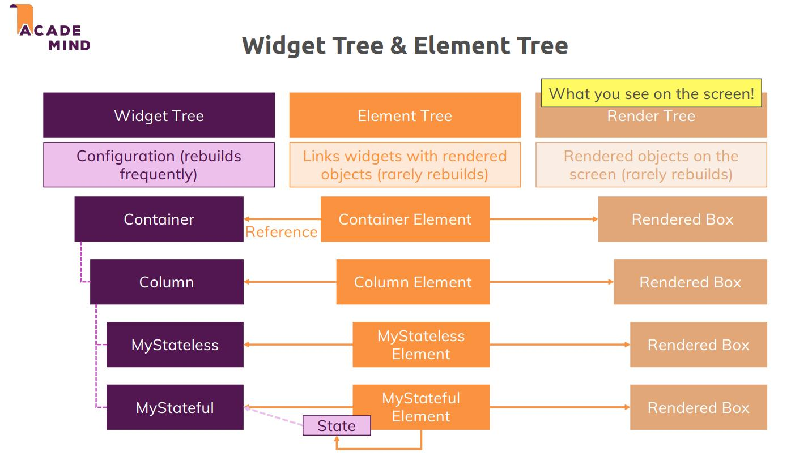

# DiaryBook

This is my first web app

## Getting Started

visit this site: https://flutter-web-128a1.web.app
```shell
cd path/to/diarybook_project/folder
flutter run -d chrome --release
```

## Deploy
First, you should install `nvm` and `Node.js`
follow this site:https://firebase.google.com/docs/cli

* Setup Firebase CLI
```shell
npm -i firebase-tools
firebase login
```

* Deploy project
<div style="background-color:rgba(0, 0, 0, 0.0470588); padding:px; margin:5px">

<span style="color:#008000"># check anything is fine in realse</span>
flutter build web 
firebase init

<span style="color:#008000">## choice options:</span>
? Which Firebase features do you want to set up for this directory? Press Space to select features, then Enter to confirm your choices. (Press \<space\> to select, \<a\> to togg
le all, \<i\> to invert selection, and \<enter\> to proceed)
 ◯ Realtime Database: Configure a security rules file for Realtime Database and (optionally) provision default instance
 ◯ Firestore: Configure security rules and indexes files for Firestore
 ◯ Functions: Configure a Cloud Functions directory and its files
❯◉ Hosting: Configure files for Firebase Hosting and (optionally) set up GitHub Action deploys
 ◯ Hosting: Set up GitHub Action deploys
 ◯ Storage: Configure a security rules file for Cloud Storage
 ◯ Emulators: Set up local emulators for Firebase products
(Move up and down to reveal more choices)

=== Project Setup
First, let's associate this project directory with a Firebase project.
You can create multiple project aliases by running firebase use --add, 
but for now we'll just set up a default project.

? Please select an option: <span style="color:#0066cc">Use an existing project</span>
? Select a default Firebase project for this directory: <span style="color:#0066cc">flutter-web-128a1 (flutter-web)</span>

=== Hosting Setup
Your public directory is the folder (relative to your project directory) that
will contain Hosting assets to be uploaded with firebase deploy. If you
have a build process for your assets, use your build's output directory.
? What do you want to use as your public directory? <span style="color:#0066cc">build/web</span>
? Configure as a single-page app (rewrite all urls to /index.html)? <span style="color:#0066cc">Yes</span>
? Set up automatic builds and deploys with GitHub? <span style="color:#0066cc">No</span>
? File build/web/index.html already exists. Overwrite? <span style="color:#0066cc">No</span>

firebase deploy
</div>

---
# Flutter Diving Deeper

###### 6-4 How Flutter Rebuilds and Repaints the Screen

|
:--:|:--:
Widget LifeCycle|Tree

每當`setState()`被呼叫時(或用MediaQuery取得的螢幕大小，被彈出鍵盤改變時)，都會重新建構Widget instance，重新執行一遍widget的lifecycle，然後Element重新指向新的instance Widget。State是獨立於Widget(單獨的Object)，所以State不會再建構一次。

###### 6-12 Understanding the Widget Lifecycle

在建構StatefulWidget instance時，過程是widget construction-->didUpdateWidget()-->build()，只有在第一次產生State時會作`initState()`，作`setState()`並不重新建構新的State instance，直到`dispose()`呼叫刪除該State object並表示該element不存在。在`didUpdateWidget(oldWidget)`新產生的widget可以比較舊的待刪除的widget情況。※這裡容易搞混的是子類State的build()其實是widget的，並不是State在build()。例如：
```dart
class NewTransaction extends StatefulWidget{
    NewTransaction(){
        print('Constructor NewTransaction Widget');
        //叫好多次
    }
    @override
    _NewTransactionState createState(){
        print('createState NewTransaction Widget');
        return _NewTransactionState();
        //只叫一次
    }
}

class _NewTransactionState extends State<NewTransaction>{
    _NewTransaction(){
        print('Constructor NewTransaction State');
        //只會叫一次
    }
    @override
    void initState(){
        super.initState();
        print('initState()');
        //只叫一次
    }
    @override
    void didiUpdateWidget(NewTransaction oldWidget){
        print('didUpdateWidget()');
        super.didUpdateWidget(oldWidget);
        //叫好多次，除了第一次不叫
    }
    @override
    void dispose(){
        print('dispose()');
        super.dispose();
        //直到element刪除，State砍掉了，呼叫一次
    }
    @override
    Widget build(BuildContext context) {
        //最容易搞混，其實是Widget在叫，建構State沒有在用這個方法
    }
}
```

###### 6-15~6-17 Using Keys

在ListView中的item如果是Stateful，就最好對每個item加上唯一key，這樣在對List資料作增刪item的時候，每個item element的State能夠確定找到對應的widget，不會將每個該對應的item之State裡的資料，配錯widget item。可以參考6-15影片"Problem with Lists and Stateful Widgets"發生的錯誤。
```dart
class _TransactionItemState extends State<TransactionItem>{
    /*
    State裡的成員資料，可能會配錯widget，
    如果先在TransactionItem widget的建構式加入唯一key
    就可以避免State配錯widget。
    */
    Color _bgColor;//會有配錯widget風險
    @override
    void initState(){
        super.initState();
        const avaiableColors = [
        Colors.red,
        Colors.black,
        Colors.blue,
        Colors.purple,
        ];
        _bgColor = avaiableColors[Random().nextInt(4)];
    }
    @override
    Widget build(BuildContext context){
        //....
        ListTile(
            leading:CircleAvatar(
                backgroundColor:_bgColor,
            ),
            //...
        );
    }
}
```
#### [What is the Difference Between initState and a Class Constructor In Flutter?](https://stackoverflow.com/questions/52066976/what-is-the-difference-between-initstate-and-a-class-constructor-in-flutter)

* The constructor simply create a new State instance, `constructor()` is used to create an instance(object).

* initState() is called after the object is created and at this point, you have access to the __BuildContext__ or the __Stateful__ Widget to which the State is attached, respectively using the context and the widget properties. At this point, the State is already mounted. `initState()` is used to initialize the contents of an already existing object.

>In this case is in reverse , let say you initialized your localVar in your constructor, then you put your localVar in your widget. You will see the value because it was set before your widget was in the tree. But if you initiliazed your localVar in initState, and use your localVar in your widget, you won't see the changes until you call setState because your widget was already create before you initialized the value. – diegoveloper Aug 29, 2018 at 0:07

###### 7-23 Replacing Pages (Instead of Pushing)

在不提供上一頁功能的時候，不要用`push()`，取代用`pushReplacement()`，可以避免APP一直堆疊畫面。然後記得每次作`push()`的時候記得要註冊RouteSetting name，這樣才好管理和使用`popUntil()`
```dart
//可以上一頁回到push前的畫面
Navigator.of(context).push(
    MaterialPageRoute(
    settings: RouteSettings(name: MainPage.routeName),
    builder: (ctx) => MainPage())
    );
//沒有上一頁可以回到push前畫面
Navigator.of(context).pushReplacement(
    MaterialPageRoute(
    settings: RouteSettings(name: MainPage.routeName),
    builder: (ctx) => MainPage())
    );
// If route has its name, we can do...
Navigator.of(context).popUntil(ModalRoute.withName(MainPage.routeName));
```
###### 7-24 Popping Pages and Passing Data Back
每種`push()`方法都回傳一個Future\<T\>，等待`pop<T>(var)`回傳var。

可以使用Route傳遞object，在`push()`方法裡有arguments參數，在被push的widget就能呼叫：
```dart
final routeArgs = ModalRoute.of(context).setting.arguments;
```
注意這裡有用到`context`因此不適合在`initState()`和`constroctor()`裡面調用。`initState`執行時機可能在widget建構中或完全建構後，這種不確定性，context不知道有沒有widget在tree裡，最好避免在`initState`裡使用context。但在10-2 Fetching Data, initState and "of(context)"，我們可以用Provider，在不要監聽的方法上使用context，(10-22 Using the "FutureBuilder" Widget and Improving the Code)例如：
```dart
initState(){
    context.read<Products>().fetchAndSetProducts();
    /*
    在fetchAndSetProducts()裡面記得呼叫notifyListeners()
    讓所有監聽中的widget能更新
    */
}
```
這裡能用的原因是Provider只要前面的資訊，不需要目前widget有沒有在context中的tree裡，所以可以在initState裡呼叫不監聽的方法[10-22]。

###### 5-5 Using the LayoutBuilder Widget
MediaQuery的另一種選擇，找到widget在tree裡面的屬於哪個Container的child，這個widget就會以這外層定義的範圍作constraints，之後在builder參數就可以引用這個constraints來定義版面。在找外層容器可以用devTool來查找。

###### 11-7 Handling Authentication Errors & 14-12 Implementing Authentication
Handle Error in credentials that are good examples


